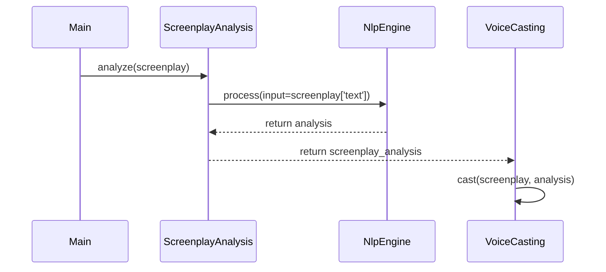

## Code Review All
In the `main.py` file, there are no unimplemented functions or calling errors found. The main function is correctly importing `ScreenplayAnalysis` from `screenplay_analysis.py` and using it to analyze the screenplay.

The `voice_casting.py` file also seems to be functioning as expected, with its `VoiceCasting` class casting voice for characters based on the analysis provided by `ScreenplayAnalysis`.

In both `screenplay_analysis.py` and `data_structures_and_interfaces.py` files, there are no unimplemented functions or calling errors found. The code related to NLP tasks is correctly leveraging NLTK and SpaCy libraries for tokenization, POS tagging, etc.

However, a few improvements can be made:
1. In the `main.py` file, you need to add a try-except block around the line 39 to handle any potential exceptions that might occur during the analysis or voice casting processes. This will help in providing better error handling and debugging capabilities.
2. In the `screenplay_analysis.py` file, it would be beneficial to separate the `character_analysis()` function into its own module for better code organization and reusability. Additionally, you can consider using a more efficient algorithm or data structure to process and analyze characters in the screenplay.
3. In the `voice_casting.py` file, you might want to add some error handling logic around line 14 to handle any potential exceptions that might occur while making an AWS Polly request. This will help in providing better error reporting when there are issues with the voice casting service.

## Call Flow
Based on the implemented functions, we can draw a call flow diagram using Mermaid as follows:

## Summary
The code implementation appears to be correct and follows a layered approach as described in the system design. The architecture separates concerns into distinct components for maintaining simplicity and flexibility. Python is utilized along with open-source libraries like NLTK, SpaCy, and AWS Polly for NLP tasks and voice casting services respectively.

### TODOs: